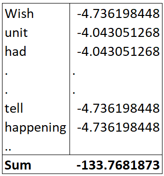
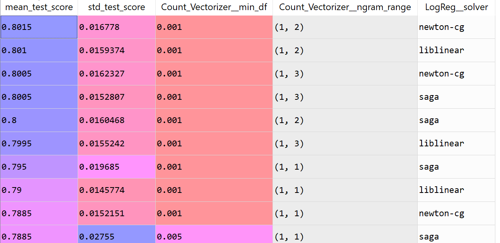

# Classifying Amazon Reviews: Overview of Naïve Bayes and NLP Sentiment Analysis with Parameter Tuning
Natural Language Processing (NLP) is a branch of machine learning that focuses on text and speech. Sentiment Analysis and Text Mining are applications of NLP that are often used to gather intelligence on large pools of text such as Twitter, hotel reviews, credit card applications to identify unsatisfied customers, stock market moves, fraud, etc. Here we model product reviews on Amazon to predict if a reviews is positive or negative. This article is organized as follows: 

- Short introduction of the intuition behid the Naïve Bayes (NB) estimator. NB estimators used for this exercise will be the Multinomial and Bernoulli NB models, which will in turn be compared to Logistic Regression. 
- Problem set-up: Pre-process the raw data and show how “tokens” and the feature matrix is created. Vectorizers used will be CountVectorizer and TfIDFVectorizer
- Stacked Parameter Tuning: Illustrates parameter tuning on a vectorizer and estimator stack using Python Sklearn's Pipeline package.
- Amazon Review Data Source: http://www.cs.jhu.edu/~mdredze/datasets/sentiment/index2.html

## Overview of Naive Bayes and Problem Setup
Bayes Theorem is a well known formula used to compute conditional probabilities: the probability of A given B conditions. It is commonly expressed as  


In the case of Amazon reviews, we are classifying a review as positive or negative (A) given a list of words or a review (B). We do this by comparing which of the two quantities is larger:

P(positive_review | word1, word2, …, wordn) <br/>
P(negative_review | word1, word2,…, wordn) 

The key is turning our B or “word1, word2,…, wordn”  into a feature matrix to compute A. This means turning each word into a feature through a process called **tokenization**. We will start with a tiny subset to illustrate what the data setup looks like through tables. Below are the first three *positive reviews*: 

Review 1: 

> Wish the unit had a separate online/offline light.  When power to the unit is missing, the single red light turns off only when the warning sounds.  The warning sound is like a lot of sounds you hear in the house so it isn't always easy to tell what is happening

Review 2: 

> I am very happy with this product. It folds super slim, so traveling with it is a breeze! Pretty good sound - not Bose quality, but for the price, very respectable! I've had it almost a year, and it has been along on many weekend get-aways, and works great. I use it alot, so it was a good purchase for me

Review 3: 

> After going through the reviews, I bought this CF card for my Canon Digital Rebel. So far it has worked fine, though I don't pretend to be an expert digital photographer. When the card is empty, it shows 127 shots available. It seems to read reasonably fast, though it takes a bit longer than I was used to with my point-and-shoot Olympus and its SmartMedia card.

A simple tokenization would be to treat every word as a single token, a unigram. We do this by listing every word, then attaching the proportion that word takes up relative to all tokens combined. After we remove common words like “the”, “and”, etc., (also called “stopwords”): we have the below probabilities for our universe of 3 positive reviews:


If we repeat this exercise for the negative reviews, we have enough information to run a Naïve Bayes classification. Given the sheer volume of possible tokens, the probabilities are converted to log scale to avoid ultra low probabilities (also known as “floating-point underflow”). Now let us say we wanted to predict if the first review was positive or negative. We would sum up the positive review log probabilities for each word then compare this sum to the sum of log probabilities for the negative reviews. 

For positive reviews, P(positive_review | word1, word2, …, wordn) looks like the below sum of log probabilities: 



If the sum -133.768 is greater than P(negative_review | word1, word2,…, wordn), then we classify the review as positive. 

In principle this is how classification is done in Naïve Bayes. However, a number of alarm bells are probably going off at this point. The first is we were able to break the joint conditional probability of the pool of words into individual conditional probabilities for each word. This means each word is considered independent, but we know this cannot be the case since they came from the same sentence.  

We are able to get away with this kind of misconduct because we only care which “naïve”  probability is larger between the positive and negative review, not how they are calculated. There are also a number of other issues that spring to mind. For example:  

  1.	Should we use one word at a time? example: “good” and “not good” both contain “good” but have opposite meanings. 
  
  2.	What if a word has more than one meaning or part of speech? 

One can also see breaking apart and tokenizing thousands of reviews or tweets can be onerous. Luckily, many of the above issues can be automated in preprocessing in Python. 

## Preprocessing and Simple Model-Fit

In this section, we will run a simple model fit after preprocessing to estaliblish a base case and llustrate how easy it is to fit a model with the tools we have. 

A quick scan of the raw review data shows the background html you would see if you hit F12 when on a website. 


To process this data, we use the package BeautifulSoup to read in the web data then create a series with the `findAll` method. The series is split by the string “review_text” BeautifulSoup is a popular and versatile package for web scraping. While there are volumes of tutorials on its use, this article only uses the parser to pull the data into a Soup object for further processing later.  In additon to BeautifulSoup, we load the usual data processing packages for Python: numpy, pandas, and matplotlib. 

```
import pandas as pd 
import numpy as np
import os
import matplotlib.pyplot as plt
from bs4 import BeautifulSoup as bfs  

positive_rev = bfs(open('positive.review').read())
positive_rev = positive_rev.findAll("review_text")
negative_rev = bfs(open('negative.review').read())
negative_rev = negative_rev.findAll("review_text")
```
To look at sample output, use the `get_text()` or `text` method: `positive_rev[1].text`

To visualize common words found in each dataset, we use the `WordCloud` package.  
```
from wordcloud import WordCloud  
def wordcloud_vis(lab_file):
    wc_string = ''
    for review in lab_file:
        rev = review.get_text()
        rev = rev.lower()d
        for msg in rev.split(" "):
            wc_string += msg + ' '
    wcloud = WordCloud(width=600, height=400).generate(wc_string)
    plt.imshow(wcloud)
    plt.axis('off')
    plt.show()

wordcloud_vis(positive_rev) 
wordcloud_vis(negative_rev)
```
This produces the following wordClouds: 

Positive Reviews: 


Negative Reviews: 


With the reviews loaded into a series, we can start creating tokens from each review string. The most popular preprocessing package to accomplish this is the NLTK library. It is common among NLP practictioners and is particularly well suited for text mining. We will use NLTK for two primary tasks: text normalization and parts-of-speech tagging. 

```
import nltk 
from nltk.stem import WordNetLemmatizer as WNL    
from nltk.corpus import wordnet 
from nltk import pos_tag
```
Text normalization is used so that words like “play” and “playing” are treated as one feature. The two most common methods for text normalization are stemming and lemmatiziation. Stemming reduces words to their root form by removing suffixes, but this may result in words that are not actual words. Lemmatizing normalizes a word to an actual root word by mapping to a database. In this case, NLTK’s Wordnet Lemmatizer, uses the Wordnet database to map root words. 

Often a word has multiple parts of speech (for example: “a new record” versus “record a conversation”). *Parts-of-speech tagging (pos-tagging)* makes sure these words are treated as different features. NLTK’s pos-tagging function creates a tuple with the word and its part-of-speech, which looks like the following: 


Wordnet has several finer groupings for parts-of-speech, but we prefer to keep our list to noun, verb, adjective, and adverb for this exercise. Hence, we use the below function to map the parts-of-speech tags to their broader groupings. 

```
def get_wordnet_pos(pos_tag):
    if pos_tag.startswith('J'):
        return wordnet.ADJ
    elif pos_tag.startswith('V'):
        return wordnet.VERB
    elif pos_tag.startswith('N'):
        return wordnet.NOUN
    elif pos_tag.startswith('R'):
        return wordnet.ADV
    else:
        return wordnet.NOUN
```
This output is fed as an argument into the lemmatizer. Now that we have our pos-tag and lemmatizer, we incorporate both in our `tokenize_this` function to generate our tokens. We also add common adjustments such as removing stopwords, making everything lower case, and ensuring a minimum length (here we use length >2) to our tokenizing function. 

```
Import string 
stopwords = set(w.rstrip() for w in open('stopwords.txt'))  #imports stopwords file

def tokenize_this(tk):
    tokens = tk.lower()
    tokens = [tk.strip() for tk in tokens.split(" ")] 
    tokens = [t for t in tokens if len(t)>2]
    tokens = [t for t in tokens if not any(c.isdigit() for c in t)]
    pos_tags = pos_tag(tokens)
    tokens = [wlem.lemmatize(t[0],get_wordnet_pos(t[1])) for t in pos_tags]
    tokens = [tk for tk in tokens if tk not in stopwords]
    tokens = " ".join(tokens)
return tokens
```
The above two functions are then used to generate our tokens, which we store in `rev_data`.

```
rev_data = []
for prev in positive_rev:
    review = tokenize_this(prev.text)
    rev_data.append(review) 
    #Vectorize review data 
for nrev in negative_rev:
    review = tokenize_this(nrev.text)
rev_data.append(review)     
```
We can now create a feature matrix by making each distinct word a feature, with each row keeping count of how many times a feature appears in the review. For the three reviews, this would look like the below table: 


The above table can be constructed with the aid of a vectorizer, a useful tool for creating feature matrices from text datasets. The simple count in the above table can be achieved with running `rev_data` through the CountVectorizer function. Another popular vectorizer is the TfdfVectorizer, which gives extra weight to features that appear less frequently and stand out from the other reviews. We load both vectorizers and fit the Naïve Bayes (Multinomial and Bernoulli) and Logistic Regression estimators with zero parameter tuning.
```
from sklearn.feature_extraction.text import TfidfVectorizer, CountVectorizer
from sklearn.model_selection import cross_val_score
from sklearn.model_selection import cross_val_predict
from sklearn.model_selection import KFold
from sklearn.linear_model import LogisticRegression as LogReg
from sklearn.naive_bayes import MultinomialNB as MNB, BernoulliNB as BNB

cvect = CountVectorizer() 
X = cvect.fit_transform(rev_data)
Y = np.zeros((len(positive_rev) + len(negative_rev)))  #creates label array
Y[0:1000] = 1   					       # label positive reviews

nmod_MNB = MNB()
nmod_BNB = BNB()

kf=KFold(n_splits=10, shuffle=True)   #default value is 5
cv_scores_MNB = cross_val_score(nmod_MNB, X, Y, cv=kf)
cv_scores_BNB = cross_val_score(nmod_BNB, X, Y, cv=kf)
cv_scores_LogReg = cross_val_score(logmod, X, Y, cv=kf)
print("Multinomial NB / CountVectorizer CV Score is %s" % "{0:.3%}".format(cv_scores_MNB.mean()))
print("Bernoulli NB / CountVectorizer CV Score is %s" % "{0:.3%}".format(cv_scores_BNB.mean()))
print("LogReg / CountVectorizer CV Score is %s" % "{0:.3%}".format(cv_scores_LogReg.mean()))
```
Using 10-fold cross validation, we obtain close to 79% accuracy for the three models. This serves as our baseline, which we will now try to improve upon with parameter tuning.


## Stacked Parameter Tuning

Parameter tuning in Python is commonly accomplished with multilayered cross-validations like `GridSearchCV` or `RandomizedSearchCV` (for larger datasets), both found in the `sklearn` library. However, since we are tuning parameters in both the vectorizer and estimator, we make use of another useful sklearn library, `Pipeline` to stack our tuning. Pipeline allows us to define a series of steps (a pipeline) before an estimator, and GridSearchCV takes multiple parameters for each step. We will illustrate this using our CountVectorizer, Bernoulli Naïve Bayes, and GridSearchCV while putting our output into a dataframe. 

```
from sklearn.pipeline import Pipeline 
from sklearn.model_selection import GridSearchCV

rev_pipe_CTNB = Pipeline([('Count_Vectorizer', cvect),
                     ('BernoulliNB', nmod_BNB)                    
                     ])

params_CTNB = {'Count_Vectorizer__ngram_range':[(1,1),(1,2),(2,2)],
            'Count_Vectorizer__min_df': [0.001, .005, .01],
            'BernoulliNB__alpha': [0.2,0.4,0.5,0.6], 
            'BernoulliNB__fit_prior':[True,False]} 

grid_cvmod_CTNB = GridSearchCV(rev_pipe_CTNB,param_grid = params_CTNB, cv=5, scoring='accuracy',return_train_score=False)
grid_cvmod_CTNB.fit(rev_data, Y)
grid_cvresults_CTNB = pd.DataFrame(grid_cvmod_CTNB.cv_results_)[['mean_test_score', 'std_test_score', 'params']]
```

There are countless permutations to try between the vectorizer and the estimator. For the vectorizer, we only focus on the n-grams and min_df parameters. N-grams refers to the number of words making up one token. Here we chose one, two, and three-word blocks. `min_df` represents the minimum percentage a word needs to appear in a dataset to be included as a feature. For the Naïve Bayes model, we tune on whether to learn class prior probabilities or not and the degree of smoothing we want on our fit (0 means no smoothing). Below we show a sample of the top permutations (out of 72) from the above CountVectorizer + Bernoulli NB pipeline: 


Below are the worst perfuming permutations: 


Looking at the above results, we see a marginal improvement on the base case of zero parameter tuning. That said, the above shows the best results correspond to a lower min_df (0.001) and an n-gram that is not (1,3). We receive very similar results when we replace the CountVectorizer with the TfidfVectorizer.

Sklearn’s Logistic Regression defaults to the `liblinear` solver method to minimize cost, as it is particularly well suited for large datasets given its use of a Lasso shrinkage model (aka L1 regularization). We will also test results for a few of the other solvers offered by the function. An explanation of the different solvers is beyond the scope of this post, but a good summary can be found [here](https://stackoverflow.com/questions/38640109/logistic-regression-python-solvers-defintions). 

```
logmod = LogReg(max_iter=4000)
rev_pipe_CTLR = Pipeline([('Count_Vectorizer', cvect),
                     ('LogReg',logmod)                    
                     ])

params_CTLR = {'Count_Vectorizer__ngram_range':[(1,1),(1,2),(1,3)],
            'Count_Vectorizer__min_df': [0.001, .005, .01],
            'LogReg__solver':['newton-cg', 'liblinear', 'saga']   # can't include all: non-convergence
                   }
```

The results from the above Logistic Regression pipeline are similar to our Naïve Bayes with the top ten listed below. It does not look like the choice of solver made a big difference. 



### Single parameter tuning. 

From the tables above, the choice of n-gram appears to make a difference. We will hone in on this parameter, using Bernoulli Naïve Bayes to see whether a unigram or bigram is better. The below generates two lists to hold cross-validated scores using the CountVectorizer and TfidfVEctorizer, then graphing the results using the seaborn package.

```
ngram_ranges = [(1,1), (1,2), (1,3)]
ngram_cv_scores = [] 
ngram_tf_scores = [] 

def cvec_ngram_crval(nrange, X, Y):
    cvec = CountVectorizer(ngram_range=(nrange))
    X_cv = cvec.fit_transform(X)
    kf=KFold(n_splits=10, shuffle=True)   #default value is 5
    cv_scores_BNB = cross_val_score(nmod_BNB, X_cv, Y, cv=kf)
    return cv_scores_BNB.mean()

def tfvec_ngram_crval(nrange, X, Y):
    tfvec = TfidfVectorizer(ngram_range=(nrange))
    X_tf = tfvec.fit_transform(X)
    kf=KFold(n_splits=10, shuffle=True)   #default value is 5
    cv_scores_BNB = cross_val_score(nmod_BNB, X_tf, Y, cv=kf)
    return cv_scores_BNB.mean()

for ngram in ngram_ranges:
    # print(ngram)
    # mu_score = "%s"% "{0:.3%}".format(cvec_ngram_crval(ngram, rev_data, Y))   : seaborn can't read %'s 
    ngram_cv_scores.append(cvec_ngram_crval(ngram, rev_data, Y))
    ngram_tf_scores.append(tfvec_ngram_crval(ngram,rev_data,Y))

import seaborn as sns
ngram_scores = ngram_cv_scores + ngram_tf_scores 
ngram_xlabels = ['ngram1','ngram2','ngram3', 'ngram1','ngram2','ngram3']
cvec_ngram_df = pd.DataFrame({'ngram':ngram_xlabels, 'cv_scores':ngram_scores})
cvec_ngram_df['vectorizer'] = 'CVEC'
cvec_ngram_df.vectorizer[3:] = 'TFIDF'
    # plot lines 
b = sns.pointplot(x = 'ngram',y='cv_scores',hue='vectorizer',data=cvec_ngram_df)
b.set_ylabel("10-fold CV Scores", fontsize=15)
b.set_xlabel("N-gram",fontsize=15)
b.tick_params(labelsize=15)
b.legend(fontsize=20)
b.axes.set_title("N-Gram vs. Cross-Val Scores (Bernoulli Naive Bayes)", fontsize=20)
```

From the chart below, we see a slight outperformance in the bigram (1,2). 


# Conclusion

This exercise provided an overview of Natural Language Processing and how to run preprocessing, model fitting, and parameter tuning on a sample set of Amazon reviews. Similar steps can be applied to hotel reviews, testing for spam/troll behavior, and credit fraud on an application. There are nearly an infinite number parameter tweaks one can do depending on the data, but we are typically limited on computation time and resources. For instance, this was a relatively small dataset (2,000 records). If we were dealing with several million rows, a full `GridSearchCV` implentation on the first pipeline (72 k-fold CV sessions) may not have been feasible. In such a case, we could use `RandomizedSearchCV` instead of GridSearchCV or reduce the number of parameter tweaks. 
