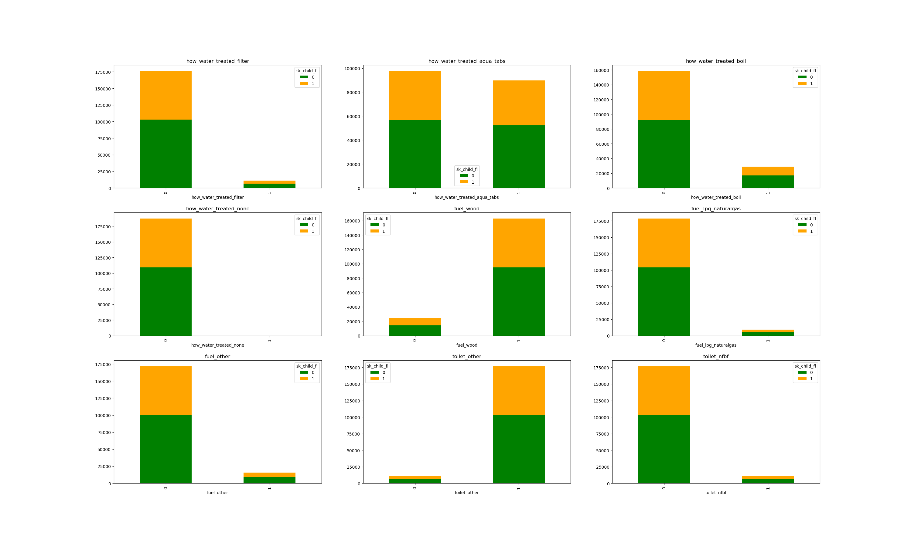
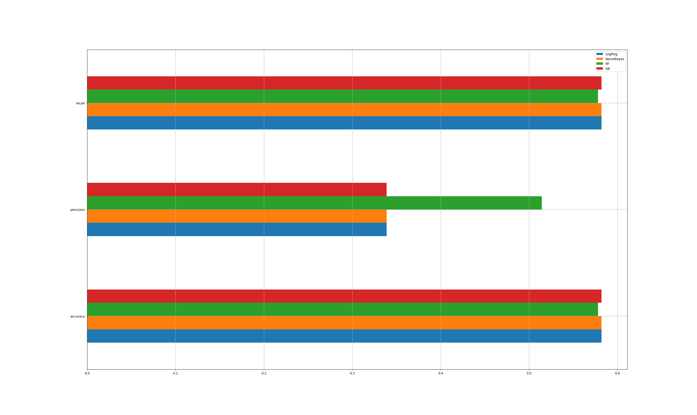

# MM Data Science: EDA Exercise 

Goal of this exercise was to gain a broad understanding of the data while extracting general insights on child illnesses, pregnancy care, and their potential relation to MM. 

## Overview of Data and Problem Setup. 
Seven files were provided with the "person" and "fm_survey" containing static information of those in the population. We pull in the data with the following code along with a few data processing packages: 

```
import numpy as np
import pandas as pd
import scipy.stats as stats
import matplotlib.pyplot as plt
import re
import os
import seaborn as sns 

fm_survey = pd.read_csv('family_survey.csv')
person = pd.read_csv('person.csv')
assmt = pd.read_csv('assessments.csv')
assess_flu = pd.read_csv('assessment_follow_up.csv')
preg = pd.read_csv('pregnancy.csv')
preg_visit = pd.read_csv('pregnancy_visit.csv')
delivery = pd.read_csv('delivery.csv')
```

Two primary groups were the focus of this exercise. 
- Sick Children: The Assessment and Assessment Follow-up tables held information on the outcome of visits. In this exercise, we assume children NOT in the assessment table while existing in the fm_survey/person tables were healthy. One pitfall of this assumption is that it may not capture sick children where the household did not reach out to a CHW. 
- Pregnant women: The pregnancy, pregnancy_visit, and delivery files capture information first filed upon detection of pregnant, subsequent check-ups, and information on the delivery respectively. 

## Sick Children

We first create the master list of children by combining information from the *person* and *family survey* files. We then isolate children age 5 and below at the time of the survey.

```
core1 =pd.merge(person, fm_survey, on='hh_id')
core1 = core1[(core1.date_of_birth>'20120101')] 
```

Our primary goal is find any personal or household characteristics that have explanatory power if a child will be prone to illness. This means our response variable is a sick/not-sick flag. We assume every child getting an assessment at least had a member of the household call in sick. However, we want to remove any records where nothing was found wrong. This is identified by every sympton and treatment coming up negative. We also create a flag for severity, by tracking if a child shows any danger signs. 

```
healthy = assmt[(assmt.patient_coughs=='no') & 
                (assmt.patient_diarrhea=='no') & 
                (assmt.patient_fever=='no') & 
                (assmt.mrdt_result.isnull()) & 
                (assmt.referral_follow_up==False) & 
                (assmt.treatment_follow_up==False) & 
                (assmt.danger_signs.isnull())]    

assmt['healthy_fl']=assmt.assessment_id.isin(healthy.assessment_id) 
assmt = assmt[(assmt.healthy_fl==False)]  # removes 12.5 healthy names
no_dg_signs = np.where(assmt.danger_signs.isnull(), 0, 1)
assmt['danger_flag'] = no_dg_signs
```
Now we can create a flag on the master list of children (`core1`) that says if a child is sick or not. This is done by merging the `core1` and `assmt` tables by their `hh_id`. However, since several children have multiple visits, we also must remove dups. This is done by defaulting to the more severe condition: where `danger_flag` is equal to 1. 

```
core1 = pd.merge(core1, assmt[['patient_id','healthy_fl','danger_flag']], on='patient_id',how='left')
    # look for duplicates
core1 =  core1.drop_duplicates(keep='first')

patient_freq= pd.DataFrame(core1.patient_id.value_counts())
patient_freq.reset_index(level=0,inplace=True)
patient_freq.columns = ['patient_id','count']
patient_freq_mult = patient_freq[(patient_freq['count']>1)]

dup_patients = core1[(core1.patient_id.isin(patient_freq_mult.patient_id))]
        # from dup_patients, remove only those with danger_flag = 0     
dup_patients = dup_patients[(dup_patients.danger_flag==1)]

core1 = core1[(~core1.patient_id.isin(dup_patients.patient_id))]
core1_dfs = [core1, dup_patients]
core1 = pd.concat(core1_dfs)
```

### Model Setup: Sick Children
To prepare the feature set, we one-hot encode all of the categorical variables into binary variables. 

```
# one-hot encodings
yes_no_list = ['has_mosquito_net','latrine','hand_washing_facilities','electricity','television',
               'cupboard','dvd','radio','clock']
for item in yes_no_list:
    core1[item] = [1 if x == 'yes' else 0 for x in core1[item]]

    #one-hot response variables
core1['danger_flag'] = [1 if x==1.0 else 0 for x in core1.danger_flag]
core1['sk_child_fl']=[1 if x==False else 0 for x in core1.healthy_fl]
    #one-hot yes-no fields

non_yesno = ['sex','how_water_treated','floor', 'walls','roof','fuel','toilet','highest_education_achieved']
for field in non_yesno:
    field_uniqs = core1[field].unique()
    field_uniqs = field_uniqs[~pd.isnull(field_uniqs)]
    for val in field_uniqs:
        field_name = field +"_" +  val
        #print(field_name)
        core1[field_name]=(core1[field]==val).astype('int')

# one-hot encoding: wealth_quintile
wealth_vals = list(core1.wealth_quintile.value_counts().index)
for val in wealth_vals:
    val_str = str(val)
    field_name = 'wealth_' + val_str 
    core1[field_name]=(core1.wealth_quintile==val).astype('int')

```

We simplify a few of the names to reference later, and we drop all non-binary variables. 

```Simplify the names
core1.rename(columns={'wealth_1.0':'wealth_1', 'wealth_2.0':'wealth_2','wealth_3.0':'wealth_3',
                      'wealth_4.0':'wealth_4','wealth_5.0': 'wealth_5'}, inplace=True)   
core1.rename(columns={'floor_floor_other':'floor_other','walls_walls_other':'walls_other',
                      'roof_roof_other':'roof_other','fuel_fuel_other':'fuel_other',
                      'toilet_toilet_other':'toilet_other', 'toilet_nofacility_bush_field':'toilet_nfbf',
                      'highest_education_achieved_primary':'hea_primary',
                      'highest_education_achieved_some_primary':'hea_some_primary',
                      'highest_education_achieved_secondary':'hea_secondary',
                      'highest_education_achieved_some_secondary':'hea_some_secondary',
                      'highest_education_achieved_none':'hea_none',
                      'highest_education_achieved_after_secondary':'hea_after_secondary'}, inplace=True)

# Drop un-needed names
core1.drop('healthy_fl', axis=1,inplace=True)

core1.drop(['how_water_treated','sex','has_mosquito_net','floor', 'walls','roof','fuel','toilet',
            'highest_education_achieved','latrine','hand_washing_facilities','electricity','television',
            'cupboard','dvd','radio','clock','wealth_quintile'],axis=1,inplace=True)
```

Now that we have our feature set, we run through a bivariate visualization on a sample to get a first look at the data. We start with water, fuel, and waste management as they have an intuitive link to pathology.

```
core1_sanit_fuel_var=[ 'how_water_treated_filter','how_water_treated_aqua_tabs',
                      'how_water_treated_boil', 'how_water_treated_none',
                      'fuel_wood','fuel_lpg_naturalgas','fuel_other',
                      'toilet_other', 'toilet_nfbf']
# bivariate plot sanitation. 
fig1=plt.figure()
for i,cat in enumerate(core1[core1_sanit_fuel_var].columns):
  var_pivot=pd.crosstab(core1[cat], core1.sk_child_fl)
  ax=fig1.add_subplot(3,3,i+1)
  var_pivot.plot(kind='bar', stacked=True, color=['green','orange'],grid=False, ax=ax, title=cat)
```

This produces the following graph: 



Despite the intuition behind linking sanitation to child sickness, it does not seem to play a significant role. 

Given that we have our respnse variable, our sick child flag 'sk_child_fl' we can also compute if a child will be sick conditional on an individual feature by using Bayes Theorem: 

**P(Sick | feature) = P(feature | Sick) * P(Sick) / P(feature)
**
```
# Bayes Conditional Probabilities 
    # create dataset with only sick kids (our priors)
core1_skids = core1[core1.sk_child_fl==1]
    # get counts for binary variables
bayes_sk = pd.DataFrame(core1_skids[core1_fields].sum(axis=0,skipna=True))
bayes_sk = bayes_sk/len(core1_skids) 
bayes_sk.reset_index(level=0, inplace=True)
bayes_sk.columns = ['field','bayes_likelihood']

core_denom = pd.DataFrame(core1[core1_fields].sum(axis=0,skipna=True))
core_denom = core_denom/len(core1)
core_denom.reset_index(level=0,inplace=True)
core_denom.columns=['field','bayes_denom_prob']

bayes_sk = pd.merge(bayes_sk, core_denom, on='field')
prob_sk = len(core1_skids) / len(core1) 
core_posteriors = bayes_num // core_denom.bayes_denom_prob
bayes_sk['posterior_prob'] = (bayes_sk.bayes_likelihood*prob_sk) / bayes_sk.bayes_denom_prob
```
Consistent with what we saw with our bivariate chart, applying bayes theorem to the features in `fm_survey` produce very similar posterior probabilities *(P(Sick | feature)* as the overall probability of sick children: ~41.8%.  


Looking at the Cramer's V correlation, which compares the relationship between categorical varaibles, produces a similar story of poor explanatory power in the variables. 


### Model Fitting 
The poor fit of individual data might produce challenges in our modeling. We will fit our data on four common models used in classification: 1. logistic regression 2. Bernoulli Naive Bayes 3. Random Forest and 4. Gradient Boosting. 

```
from sklearn.model_selection import train_test_split as TTS, cross_val_score, cross_val_predict, KFold
from sklearn.metrics import accuracy_score, precision_score, recall_score, confusion_matrix, precision_recall_curve
from sklearn.linear_model import LogisticRegression as LogReg
from sklearn.naive_bayes import MultinomialNB as MNB, BernoulliNB as BNB, GaussianNB as GNB
from sklearn.ensemble import RandomForestClassifier as RFC, GradientBoostingClassifier as GBC
```

Since we will also be using cross validation, we want to shrink the initial list of variables to use. While our earlier EDA has not identified any strong variables to start, we can employ the sampling method found in random forest to extract variable importance. 

```
# Variable importance with RF model 
    # preliminary split of data 
feat_sk = core1[core1_features].as_matrix()
y_sk = core1['sk_child_fl'].as_matrix()
x_train_sk, x_test_sk, y_train_sk, y_test_sk = TTS(feat_sk, y_sk, test_size=0.15, random_state=123, stratify=y_sk)
rfmod_sk = RFC()
rfmod_sk.fit(x_train_sk, y_train_sk)
rf_imp_sk = rfmod_sk.feature_importances_

    # Create importance chart
imptree_features = {'field':core1_features, 'importance':rfmod_sk.feature_importances_}
imptree_features_df = pd.DataFrame(imptree_features).sort_values('importance', ascending=False)
```

This produces the below variable importance chart. 


While far from ideal, the variable importance chart gives us a starting point for shrinking our feature set. We start with the top 15 variables, which in our case covers roughly 65% of all variable importance. 

```
imp_top15 = list(imptree_features_df.field[0:15])   #top 15 make up 70% of importance 
feat_sm_sk = core1[imp_top15].as_matrix()
```
We now fit these 15 variables on our sick child flag using our four classification models 5-fold cross-validation. 

```
# Cross Validation: Start w/ 5-fold CV
kf=KFold(n_splits=5, shuffle=True)   #default value is 5

# Fit model 
    # Initialize new models. RF has already been initialized. 
logmod_sk = LogReg()
nbmod_sk = BNB()
# rfmod_sk defined above) 
gbmod_sk = GBC()

# Create dataframe to hold metrics in a table. 
metric_results = pd.DataFrame(index=['accuracy','precision','recall'], 
                              columns = ['LogReg','NaiveBayes','RF','GB'])

      # Accuracy Scores
metric_results.loc['accuracy','LogReg'] = cross_val_score(logmod_sk, feat_sm_sk, y_sk, scoring='accuracy',cv=kf).mean()
metric_results.loc['accuracy','NaiveBayes'] = cross_val_score(nbmod_sk, feat_sm_sk, y_sk, scoring='accuracy',cv=kf).mean()
metric_results.loc['accuracy','RF'] = cross_val_score(rfmod_sk, feat_sm_sk, y_sk, scoring='accuracy',cv=kf).mean()
metric_results.loc['accuracy','GB'] = cross_val_score(gbmod_sk, feat_sm_sk, y_sk, scoring='accuracy',cv=kf).mean() 
       # Precision Scores 
metric_results.loc['precision','LogReg'] = cross_val_score(logmod_sk, feat_sm_sk, y_sk,scoring='precision_weighted', cv=kf).mean()
metric_results.loc['precision','NaiveBayes'] = cross_val_score(nbmod_sk, feat_sm_sk, y_sk, scoring='precision_weighted', cv=kf).mean()
metric_results.loc['precision','RF'] = cross_val_score(rfmod_sk, feat_sm_sk, y_sk, scoring='precision_weighted', cv=kf).mean()
metric_results.loc['precision','GB'] = cross_val_score(gbmod_sk, feat_sm_sk, y_sk, scoring='precision_weighted', cv=kf).mean()
        # Recall Scores 
metric_results.loc['recall','LogReg'] = cross_val_score(logmod_sk, feat_sm_sk, y_sk,scoring='recall_weighted', cv=kf).mean()
metric_results.loc['recall','NaiveBayes'] = cross_val_score(nbmod_sk, feat_sm_sk, y_sk, scoring='recall_weighted', cv=kf).mean()
metric_results.loc['recall','RF'] = cross_val_score(rfmod_sk, feat_sm_sk, y_sk, scoring='recall_weighted', cv=kf).mean()
metric_results.loc['recall','GB'] = cross_val_score(gbmod_sk, feat_sm_sk, y_sk, scoring='recall_weighted', cv=kf).mean()
```

Graphing the results in 'metric_results', we see there is not a large difference between the model with the exception of Random Forest which has a strong precision score. Overall, the accuracies for each of the four models using 15 of 29 features hover close to 58%, which is not much better than a random guess.



### Thoughts / Further Research: Child Sickness/Pathology
Given the lack of explanatory power from the variables, further research will likely start with incorporating new variables or feature engineering on the existing fields.Toddlers are generally still developing their own immunity and are particularly vulnerable to any pathology. Hence, there is a lot of noise when trying to broadly link sickness in toddlers to static factors like the home. While higher severity sickness is far less frequent, its different gradations may show stronger linkage to the data. 

Given the relatively high number of transactions, other forms of statistical methods, machine learning, and model tuning can be brought to be bear. Feature engineering between the different variables would also naturally result from better familiarty with the data and target population. 


## Pregnancy Data
Unlike sickness in children, pregnancies have an ultimate delivery or terminal event. Starting with the visits from the CHWs, which are logged in the *pregnancy_visit* file, we track the outcome in *delivery.* We also note that all instances of the `danger_sign` field being populated resulted in a referral to a health facility. Hence, we can use 'referred_to_health_facility' to track troubled pregnancies in this cohort. We do this by creating a table with the number of CHW visits to a patient and the outcome of the pregnancy.

```
preg_referred = preg_visit[(preg_visit.referred_to_health_facility==True)].sort_values('patient_id') # produces 3.7k unique patients
preg_refvisits= pd.DataFrame(preg_referred.patient_id.value_counts())
preg_refvisits.reset_index(level=0,inplace=True)
preg_refvisits.columns = ['patient_id','count']   # extra points to CHW for more visits? 
delivery_danger = delivery[['patient_id','danger_signs_at_delivery']]
preg_refvisits = pd.merge(preg_refvisits,delivery_danger,on='patient_id', how='left') 
```

Looking at the `.value_counts()` for `preg_refvisits`, almost 98% of the troubled pregnancies (1965 out of 2006) had a smooth delivery at the end. While not all of this can be attributed to the CHW, it is worth noting. This positive work of the CHWs is also noted in their 94% *post-delivery first-time visit rate.* 

### Thoughts / Further Research: Pregnancies
One unfortunate piece of the data was that the CHW failed to record if there were danger signs in roughly 25% of the deliveries. Nonetheless, the performance of the CHW sems very positive in regards to pregnancy monitoring. 

Similar to the section above, further research could be done on a few areas: 
- Severity: the danger signs themselves to come up with a degree of severity. This could be then linked back to more environmental factors like those found in the family survey. 
- Prediction: Linked to the first point on severity. Similar to above, a number of models can be fit and performance tracked with more granular data. 
